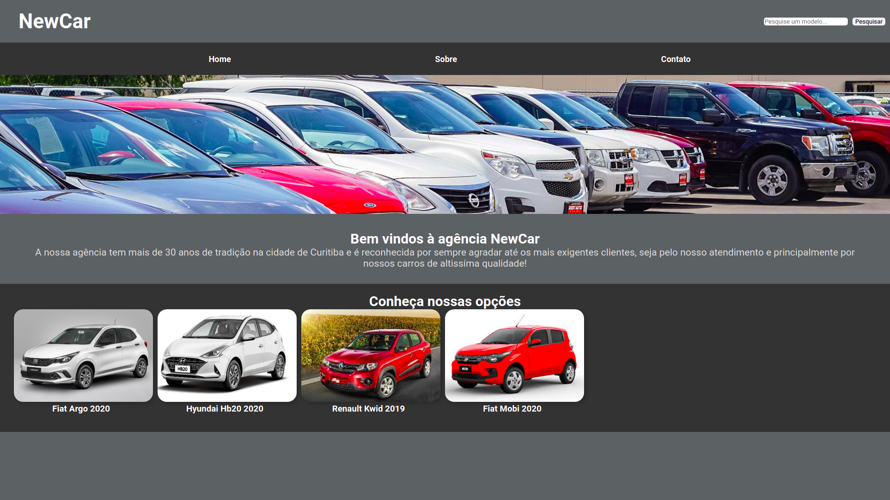
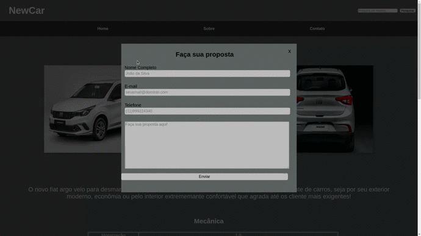
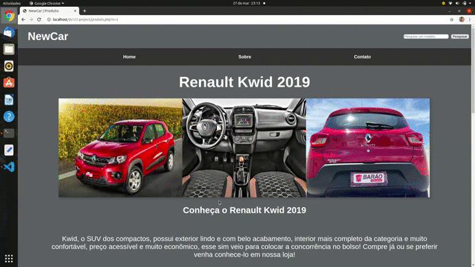
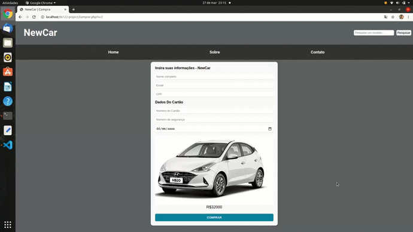
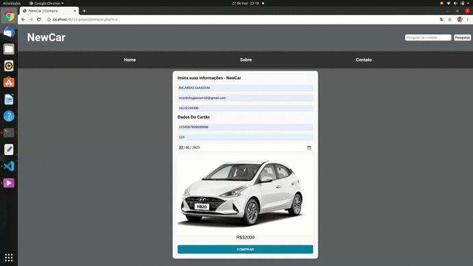
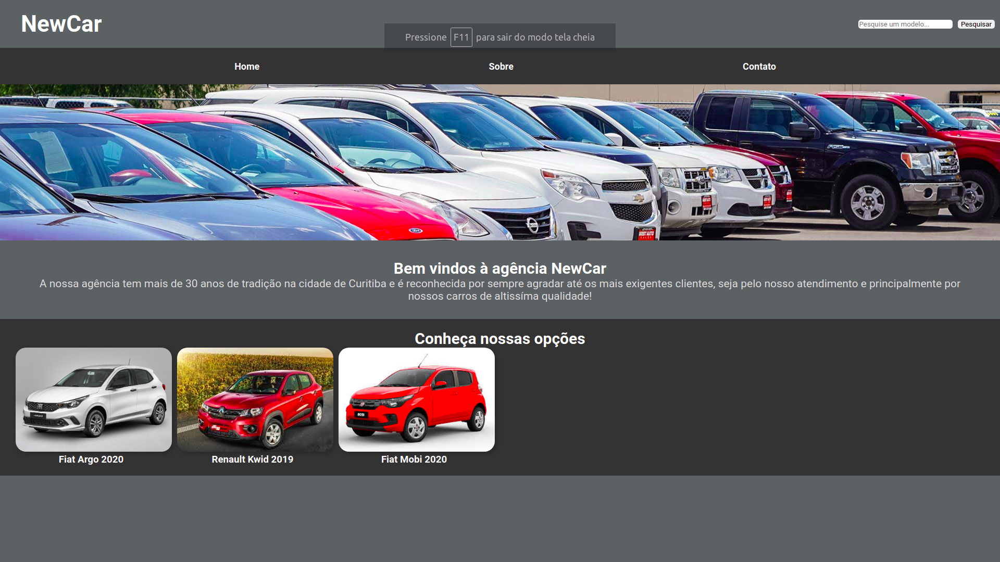
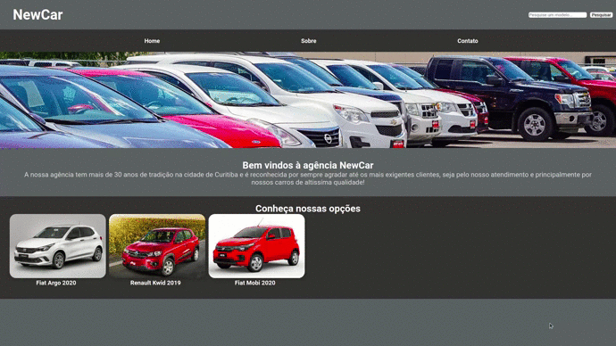
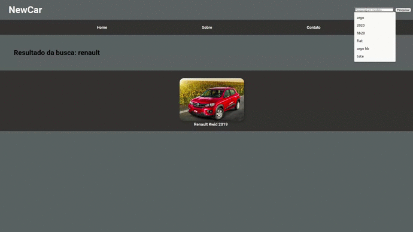

# DS122 - Projeto

<h1 style="text-align: center;">Projeto de DS122 WEB 1</h1>

<h2>Autores:</h2>
<ul>
    <li><a href="https://github.com/lucaszawadneak">Lucas Cassilha Zawadneak</a></li>
    <li><a href="https://github.com/Renan-git">Renan Cordeiro Ramos</a></li>
    <li><a href="https://github.com/RicardinhoFilho">Ricardo Pinto Giasson Filho </a></li>
</ul>

<h2>Tecnologias Utilizadas</h2>
<ul>
    <li>HTML</li>
    <li>
        CSS <ul>
            <li>Boostrap</li>
        </ul>
    </li>
    <li>JavaScript
        <ul>
            <li>JQuery</li>
        </ul>
    </li>
    <li>PHP</li>
    <li>MySql</li>
</ul>

<h2>Como Utilizar</h2>
<ol>
    <li>Realizar o clone do projeto na pasta raiz do seu servidor web;</li>
    <li>Alterar o arquivo <code>db_credentials.php</code> com as credencias de seu banco MySql;</li>
    <li>Acessar <code>cria_db_tabela.php</code>(arquivo responsável por criar o Banco e reespectivas tabelas);</li>
    <li>Acessar <code>alimentaTabelas.php</code>(Este arquivo alimenta as tabelas com alguns produtos);</li>
</ol>

<h2>Objetivo do Projeto</h2>

Projeto desenvolvido durante o curso de WEB-1(UFPR) ministrada pelo professor <a
        href="https://github.com/alexkutzke">Alex Kutzkea<a>, com objetivo finalização do curso praticando todas as
            técnologias abordadas pela discplina!

<h2>Descrição do Projeto</h2>

A <code>index.php</code> é a página principal de nosso projeto:   
      Exibimos o cabeçalho de nossa página com links
<ul>
    <li>Home</li>
    <li>Sobre</li>
    <li>Contato</li>
</ul>
Além de nossa campo de busca. Também Exibimos todos os carros disponíveis para compra!

É possível clicar em cima dos carros para navegarmos para <code>produto.php</code>  

    
      
   
Nesta página temos uma visão melhor do carro, com dados mais detalhados como mecância, segurança e conforto, além de
    um vídeo de propaganda! Dentro desta página é possivel utilizarmos o recurso "Proposta", que abre um Modal de
    cadastro, para o usuário entrar em contato com a equipe de atendimento da empre MyCar:
    
      
   
   
Ao prencheer estes campos corretamente, os dados do cliente serão gravados em nosso banco de dados!  

Dentro da página <code>produto.php</code> é possível acessar o vídeo referentre ao produto:
    
   
      
   

A página <code>comprar.php</code> apresenta ao nosso usuário o veículo que ele selecionou e um formulário para
    confirmar a compra.
       
      
    Como podemos ver no exemplo acima, nosso usuário simulou uma o preenchimento com dados indevidos(cpf:"11122233395" e
    código de segurança:"abc"), invalidando o envioo de seu formulário!
    
   
      

    
Já no exemplo acima, simulamos uma compra com dados válidos!
Perceba que agora, nosso HB20 já consta como Indisponivel, e já se tornando a compra deste porduto impossível:
      
 
      
    Na imagem acima, podemos perceber que o produto HB20 já não consta mais em nossa lista de produtos disponíveis!

Támbém podemos navegar sobre os links de nosso cabeçalho e interagir com o campo de busca:
    
  
    
      
    Podemos fazer qualquer tipo de pesquisa:
       
    
      
    
Nossa página nos retorna o maior número de itens encontrados, separando palavra por palavra. Quando pesquisamos Fiat 2020 por exemplo, a nossa página nos  tras todos os fiats, todos os fiats 2020 e todos os carros 2020. Está tática é usada para despertar mais ainda o interesse sobre nosso cliente! 

